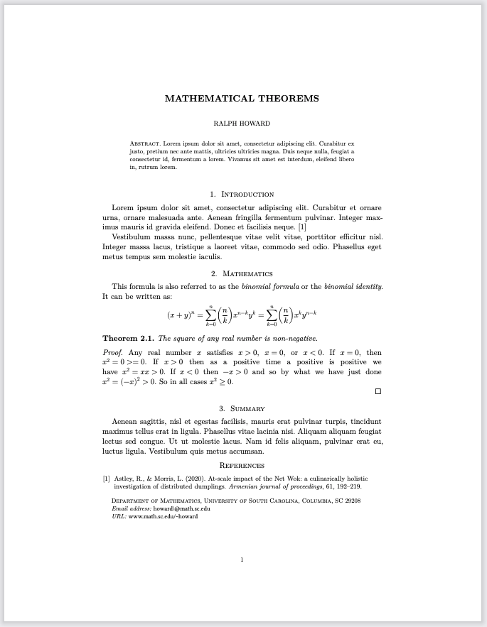

# Typst AMS Format

Based on the AMS template published by the Typst team at <https://typst/typst-templates/ams>.

**NOTE**: This format requires the pre-release version of Quarto v1.4, which you can download here: <https://quarto.org/docs/download/prerelease>.

## Installing

```bash
quarto use template quarto-ext/typst-templates/ams
```

This will install the extension and create an example qmd file that you can use as a starting place for your document.

## Using

The example qmd demonstrates the document options supported by the IEE format (`title`, `authors`, `abstract`, `bibliography`, etc.). For example, your document options might look something like this:

```yaml
---
title: "Mathematical Theorems"
authors: 
  - name: Ralph Howard
    email: "howard@math.sc.edu"
    url: "www.math.sc.edu/~howard"
    affiliations: 
      - name: University of South Carolina
        department: Department of Mathematics
        city: Columbia
        state: SC
        postal-code: 29208
abstract: |
  Lorem ipsum dolor sit amet, consectetur adipiscing elit.
  Curabitur ex justo, pretium nec ante mattis, ultricies
  ultricies magna. Duis neque nulla, feugiat a consectetur id,
  fermentum a lorem. Vivamus sit amet est interdum, eleifend
  libero in, rutrum lorem. 
format:
  ams-typst: default
bibliography: refs.bib
---
```

This document would be rendered as:


